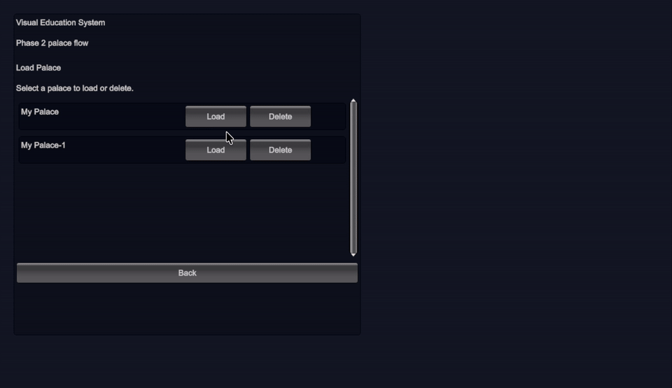
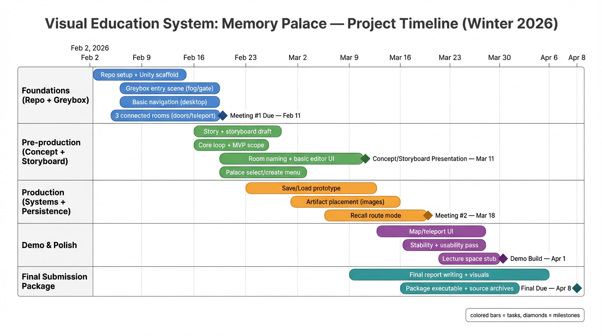

# Visual Education System

An interactive memory-palace prototype built in Unity. The current repo now supports Project Meeting #2 by pairing the playable greybox build with submission materials that document iteration, design goals, paper prototyping, and game testing.

## Index

- [Project Summary](#project-summary)
- [Current Build](#current-build)
- [Meeting 2 Submission Docs](#meeting-2-submission-docs)
- [Core User Flow](#core-user-flow)
- [Demo Video](#demo-video)
- [Storyboard And Concept Docs](#storyboard-and-concept-docs)
- [Timeline](#timeline)
- [Project Structure](#project-structure)
- [How To Run](#how-to-run)
- [Controls](#controls)
- [Current Scope](#current-scope)
- [Next Steps](#next-steps)

## Project Summary

The project explores a digital memory-palace system where a user creates and edits a personalized palace made of named rooms. The design uses strong spatial cues such as branching room layout, room colors, entrance labels, icons, and a unique central landmark so each palace is easier to recognize and remember.

The current repo reflects an iterative production path:

- concept framing around spatial memory and room-based learning
- greybox layout centered on an orienting Entry Hall
- room identity through names, colors, and entrance markers
- user editing through in-game rename and recolor tools
- persistence through named palace save/load
- meeting-ready documentation for prototyping and testing

Longer-term product goals beyond the current prototype:

- sub-rooms inside rooms for deeper topic hierarchy
- memory clues inside rooms, such as images, notes, videos, and files
- rehearsal or lecturing spaces for practicing memorization
- VR headset support for a more immersive palace experience

Key goals in the current prototype:

- create or load a named palace
- enter a central Entry Hall that branches to multiple rooms
- rename rooms and recolor them
- add one new branch room from the Entry Hall
- save and reload palace state through simple JSON files

[Back to top](#visual-education-system)

## Current Build

The current playable prototype includes:

- `Bootstrap -> MainMenu -> PrototypePalace` scene flow
- first-person movement with keyboard and mouse
- Entry Hall hub connected to multiple rooms
- readable entrance signs with labels and icons
- room HUD and palace HUD
- in-editor room editing panel
- palace naming and room naming validation
- named save/load menu with delete support
- palace-specific center landmark in the Entry Hall

[Back to top](#visual-education-system)

## Meeting 2 Submission Docs

The key submission-facing materials for Project Meeting #2 are:

- [Submission Summary](./docs/Submission-Summary-Full.md)
- [Game Testing Plan](./docs/Game-Testing-Plan.md)
- [Engineering Roadmap](./docs/Engineering-Roadmap.md)
- [Paper Prototype Layout](./docs/assets/Paper-Prototype-Layout.svg)
- [Repository Recommendations](./docs/Repository-Recommendations.md)
- [Storyboard Slides PDF](./docs/Storyboard-Concept-Slides.pdf)

[Back to top](#visual-education-system)

## Core User Flow

1. Start the app.
2. Choose `New Palace` or `Load Palace`.
3. Enter the Entry Hall.
4. Walk to different rooms through labeled branches.
5. Press `E` to edit the current room.
6. In Entry Hall, rename the palace or add a new branch room.
7. Save changes through the current room editor flow.
8. Return to the menu and reload the palace from JSON.

[Back to top](#visual-education-system)

## Demo Video

Quick preview:



Full demo recording:

- [VES-Memory-Palace-Phase-2-Mar-11-Demo.mov](./VES-Memory-Palace-Phase-2-Mar-11-Demo.mov)

[Back to top](#visual-education-system)

## Storyboard And Concept Docs

The main project documentation for presentation and submission is included in this repo:

- [Meeting 2 Submission Summary (Short)](./docs/Submission-Summary.md)
- [Meeting 2 Submission Summary (Full)](./docs/Submission-Summary-Full.md)
- [Game Testing Plan](./docs/Game-Testing-Plan.md)
- [Engineering Roadmap](./docs/Engineering-Roadmap.md)
- [Paper Prototype Layout](./docs/assets/Paper-Prototype-Layout.svg)
- [Repository Recommendations](./docs/Repository-Recommendations.md)
- [Storyboard Slides PDF](./docs/Storyboard-Concept-Slides.pdf)
- [Presentation Notes](./docs/Storyboard-Concept-Notes.md)

[Back to top](#visual-education-system)

## Timeline

Updated visual time flow chart:



[Back to top](#visual-education-system)

## Project Structure

```text
submitted/
├── README.md
├── VES-Memory-Palace-Phase-2-Mar-11-Demo.mov
├── docs/
│   ├── Storyboard-Concept-Slides.pdf
│   ├── Storyboard-Concept-Notes.md
│   ├── Submission-Summary.md
│   ├── Submission-Summary-Full.md
│   ├── Game-Testing-Plan.md
│   ├── Engineering-Roadmap.md
│   ├── Repository-Recommendations.md
│   └── assets/
│       ├── Gantt-Plan.png
│       ├── Paper-Prototype-Layout.svg
│       └── demo-preview.gif
└── VisualEducationSystem/
    ├── Assets/
    │   ├── Scenes/
    │   └── Scripts/
    ├── Packages/
    └── ProjectSettings/
```

[Back to top](#visual-education-system)

## How To Run

1. Open `submitted/VisualEducationSystem` in Unity.
2. Open `Assets/Scenes/Bootstrap.unity`.
3. Press Play.
4. Create a palace or load an existing palace from the main menu.

[Back to top](#visual-education-system)

## Controls

- `W A S D`: move
- `Mouse`: look
- `E`: open or close room editor
- `Esc`: return to main menu, or close the editor/menu panel first

[Back to top](#visual-education-system)

## Current Scope

Included now:

- palace creation
- palace loading and deletion
- room naming and recoloring
- one additional room branch from Entry Hall
- duplicate-name prevention for palaces and rooms
- JSON save/load prototype

Not finished yet:

- polished art pass
- authored UI canvases instead of all immediate-mode debug UI
- multi-room branching from sub-rooms
- in-room memory-clue placement for pictures, notes, videos, and files
- rehearsal or lecturing room functionality
- VR-ready interaction and deployment support
- advanced save slots metadata
- formal playtesting evidence beyond the current meeting plan

[Back to top](#visual-education-system)

## Next Steps

- refine UI presentation for class/demo use
- improve visual polish and room theming
- expand the room-edit loop beyond one extra room and into sub-rooms
- add memory-clue systems for images, handwriting-style notes, videos, and files
- add rehearsal or lecturing spaces for memorization practice
- investigate VR headset support
- run and record structured playtests
- connect the playable prototype to final presentation materials

[Back to top](#visual-education-system)
